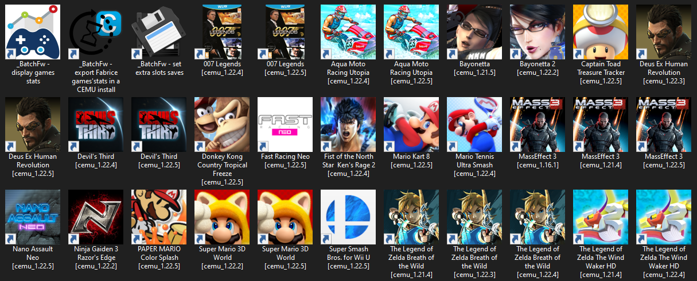

# CEMU's Batch FrameWork

BatchFw is a free framework for **CEMU** (WII-U emulator) based on batch, wmic outputs, powershell, vbs scripts and 3rd party tools.

It allows you to launch your loadiines games (uncompressed RPX) using **many versions of CEMU** without messing around with controler profiles, saves, duplicating update and/or DLC installations, shaders caches... for many users on many hosts (making your **game library portable** using the -mlc argument. CEMU needs to be installed on each host as the shader cache is host dependant).

As the mlc01 folder and settings are located in the game's one, you can backup the whole game including saves for all users, update, DLC, settings into a single archive file easily.

**You can keep the best version of CEMU for a given game and update each version for each game gradually.**

**Versions of CEMU tested : 1.11.6 to 1.25.4** (if you want to use earlier versions, create an installation per game and per user)

(**1.22.7 is not compatible** because it did not parse the mlc argument correctlty)

I recommend to stay in this range (versions that i have checked) but you don't really risk much to try newer versions (all manipulations on xml files in BatchFw use the least restrictive XPath requests possible and must therefore work even if the settings.xml file is reorganized)

To download a previous version of CEMU (VX.Y.Z), go to http://cemu.info/releases/cemu_X.Y.Z.zip

CEMU's process is monitored and its priority pushed from "above nromal" to "high" to **minimize FPS drops while in game**. 
A lock file is used to allow only one instance of CEMU and to **avoid thread safe issues**. CEMU's return code is analyzed before backuping your saves in order to **avoid saves corruption if CEMU crashes**.

BatchFw handles as many users as you want. All users can play even with old versions of CEMU (in BatcFw all users use the default account 8000001).
It also allows to create extra saves slots to define **multiple saves per user for each game**.

If you choose to let BatchFw complete your GFX packs during the setup, it will creates the missing resolution presets for the current aspect ratio (on every host used).

**Last GFX packs checked (presets completion) : V828**

BatchFw **creates resolution GFX packs for games** with no GFX packs provided (which are automatically replaced by the official ones when they'll be available). 
It computes the current aspect ratio using your screen resolution (so it **works on every display configuration setup**, dual triple screen...) 

It also **creates FPS GFX packs** to control the **emulation's speed or increasing FPS** for games that allow it (V-Sync needs to be disabled). 

If you update to a more recent configuration not listed here and encouter issues, just force the update the GFX packs folder after forbid BatchFw to complete the packs in the setup (to use stocks ones).

For Wii-U owners, BatchFw comes with a **complete FTP interface** to update your accounts (online files, friends list...) and mostly to **import/export your saves for all users between CEMU and the Wii-U**. You can choose to **synchronize your CEMU save with the Wii-U one or choose to keep both saves to play with CEMU** (an extra slot is created and used automatically for import/export saves process). 

Ftpiiu (ftp-everywhere and others) does not set rights on files injected. Some games (such as WWHD) invalidate the injected files, **you have to use [WiiU FTP Server]( https://github.com/Laf111/WiiUFtpServer) to fix it** (provided in ./resources/WiiuSDcard.rar).

# 
**IMPORTANT : Do not clone the repository (unless you're quite familiar with batch scripts) because GitHub will format all files from ANSI to UTF-8 and it might break silentlty some scripts** : go to the "[releases](https://github.com/Laf111/CEMU-Batch-Framework/releases)" section in this page to get the last released version else **see recommendations at the end of this page**.
#

## How it works:

All by creating shortcuts (or executables) on your desktop - or a folder of your choice.

With BatchFw there's no need to bother about saves, caches, controller profiles, CEMU or CemuHook settings and precompiled cache ignoring if you're an NVidia user - since you won't need to build a shader cache for each version. BatchFw use the -mlc argument (introduced since 1.10) to set the mlc01 folder path outside the CEMU's folder. 

The mlc01 path is in the game folder so:

- your games library becomes portable: you can put it on an external drive and play on differents hosts (settings are stored by host and you only have to manage the shortcuts you created for each Cemu install on each host);

- you didn't go with a "big" mlc01 folder containing mixed saves, updates and DLC (including games you have deleted/uninstalled which is the case by default or even if you use an external mlc01 folder);

- you can backup a whole game by compressing its folder (saves, updates, DLC, controller profiles, settings... are ALL included).

- uninstalling a game consist just in delete its folder.

## Main purpose and features :

- **Making easier the installation of many versions of CEMU** to launch your games (with BatchFw CEMU installs size only few MB);

- **Switch freely from a version of CEMU** to another for a given game, and play with the same data you had on the first one;

- **Switch from game to game and automatically have all your data saved or restored** on a given version of the CEMU emulator;

- **Avoid regression on games (and downgrade manually CEMU's version)** by keeping the versions that work best with your games (CEMU as a reverse engineering software oftenlty tends to introduce regression on some games to enhance emulation of other ones);

- **Batch install of uncompressed Games+Update+DLC folders (no need to install update and DLC using CEMU)**;

- **Complete/create GFX packs for ALL games** (even if they are still not officially supported). Support all aspect ratios (multi-screen) including TV one (HDTV, ultrawide, DCI) and also support custom user's ones;

- **create FPS packs** (V-sync need to be disabled) : it allows you to **play some games at 105, 110 or 120% emulation speed** and for most of titles **boost FPS to your refresh screen rate;**  

- **launch and close one or more third party softwares (DS4windows, Wiimotehook ...);**

- **Handle more than one user/save also with versions of CEMU < 1.15.19**;

- **Handle multiple saves per user for each games (extra save slots)**;

- **Make your loadiine games library portable :**
    - save settings PER user (including GFX and mods packs) and PER host;
    - game stats per user (using all version of CEMU that supports it) for all hosts used;
    - handle drive letter changing when used on an external drive (rebuild all the links so you can also use this feature if you want to move your games location);
    - synchronize saves, transferable cache and game stats between BatchFw installs;

- **Keep my games up to date** (silently check update and DLC availability);

- **Secure your saves and trabferable cache** with 2 levels of backup

- **Provide scripts to import/export saves, transferable cache and game stats to a CEMU install** (including CEMU accounts handling);

- **GPU Cache backup/restore** (AMD, NVIDIA / OpenGL, Vulkan) **per game (to avoid a "big" cache mixing shaders for all games and out of VRAM issues);**

- **Automatic GLCache cleanup when updating display drivers (CEMU leaves the old one);**

- **Your own games compatibility datase per host** you use (BatchFW logs silently the first version of CEMU that manages to run a game on this host);

- **Your own CEMU X.Y.Z games compatibility list per host**: compatibility per version and per host of all your games (last column in the csv file = code you have to enter @ http://compat.cemu.info/ to report your feedback for a game and it is filled automatically with your specs and the settings used);

- **Easy game profiles tweak** per version (using shortcuts);

- **Double automatic backup of your transferable cache and saves for each games to avoid their corruption that can occur on CEMU crash;**

- **Automatic graphic packs update (check availability);**

- **Automatic update (check availability);**

- **check pre requisites on each hosts (NTFS / mklink success / vbs & powershell scripts execution);**

- **optional progress bar to follow pre and post treatments** (WARNING : cost to double launching time at least)

- **For Wii-U owners: full automated FTP interface + automatic installation of requiered files to play online** 
    - Prepare a SDcard content for your Wii-U (optional) : format using fat32format and install apps (HBL, DDD, NandDumper, CBHC, Loadiine_GX2, MOCHA, SigPatcher2SysMenu, WUP_installer_GX2, WiiUFtpServer, NUSspli);
    - get/sync online files (account, friends'list);
    - sync saves between CEMU with the Wii-U;
    - sync game stats between CEMU and the Wii-U;
    - get a snapshot of the games installed (saves, update, dlc, location mlc/usb);
    - dump safely a list of games automatically (scripts using a snapshot taken previously, ignoring errors caused by symlinks and using 2 passes of sync command). Games are ready to be launched (saves, update and DLC are installed automatically by BatchFw);
    - enable/disable Wii-U firmware update feature (by removing/creating the folder /storage_mlc/sys/update);
    - ping the wii-U to avoid online simultaneous access;
    - inject Games using NUSspli

## Install/Uninstall: 

- **Extract in your games folder**;
- **Launch _BatchFW_Install\\setup.bat**;
- **move or copy your mlc01 data when asked**;
    - if you use external mlc01 folders per user, import all of them
    - if you use a CEMU installs per user, register all installs with importing mlc01 data   

When done, you can copy the whole directory containing your games and BatchFw install folder on an external drive to make your games library portable. To play on a new host, install CEMU on the new host and install BatchFw from the external device to create shortcuts (users and trird party software already defined on another host are imported automatically, online files as well). 

Settings are saved by host (and per users). Transferable cache, controller profiles, graphic packs are shared/completed by all users on all hosts.

To uninstall BatchFw, use the dedicated script.

## How to use:

- You want to create shortcuts to all your games for versions of CEMU using the ones created after the installation on your desktop?:

    - "C:\Users\\%USERNAME%\Desktop\Wii-U Games\BatchFW\Create CEMU's shortcuts for selected games.lnk" for a single CEMU version;

    - "C:\Users\\%USERNAME%\Desktop\Wii-U Games\BatchFW\Set BatchFw settings and register CEMU installs.lnk" for more than one version (call setup.bat in silent mode);

- You want to change the way how Cemu is launched?: delete the shortcuts and re-create them;

- You want to delete your settings for version X.Y.Z or you want to recreate them?: use "C:\Users\\%USERNAME%\Desktop\Wii-U Games\CEMU\cemu_X.Y.Z\Delete my cemu_X.Y.Z's settings.lnk";

- You want to add a game?: once in your games folder, create shortcuts to this game with one or more version of CEMU by relaunching one of the 2 first scripts listed above;

- If shortcuts created before are broken (because the drive letter have changed for an USB drive or simply because you have moved your games): use the shortcut "Wii-U Games\Fix broken shortcuts.lnk";

- You don't need to manually open CEMU to play. Once you have collected all the settings (on the first launch of a game) for all versions of CEMU you play on, use the shortcuts on your desktop (Or your shortcuts folder);

PLEASE DON'T TOUCH/MOVE FILES UNDER ./LOGS ESPECIALLY HOST_\*.LOG BECAUSE THESE FILES ARE USED TO 
SAVED BATCHFW'S SETTINGS FOR EACH HOST USED

IF YOU ENCOUNTER ANY ISSUE, TRY RESET BATCH FW TO FACTORY SETTINGS USING "WII-U GAMES\BATCHFW\RESET BATCHFW.LNK"

Once mlc01 data are moved to game's folder. BatchFw "only" prepare CEMU's workspace.
Issues that could be affected to BatchFw are :
- online files are missing (if you have a Wii-U)
- saves/games stats not found/saved
- settings missing/not saved
- GFX packs are missing
- no cache found (transferable or GLCache)
Other issues should be related to CEMU itself.

"How to" informations are displayed in the console when creating shortcuts.

BatchFW does not need Adminstrator rights unless you want to create shortcuts at specifics locations.

All batch source code use delayed expansion mode and set your system charset to check/handle the minimum of unsupported characters in paths. When launching a game, batchFw is completly silent. It opens its log if needed and open Cemu's one if it crashes.

Code is well commented and is read only. 

## Tutorials & videos:

**Install, create a portable loadiine library, complete/create custom GFX packs, synchronize installs, revert, uninstall:**  https://1drv.ms/v/s!Apr2zdKB1g7fgkS7wOmXmanOFRRp?e=qhwmgU

- 02:00 : install games directly (only put game, DLC and update folder in your games'folder)

- 07:45 : import saves/transferable cache/update/DLC and games stats from existing CEMU's installation

- 19:45 : use the same shader cache for CEMU 1.15.18, 1.17.0 and 1.17.1 (slow build only one time on the first run)

- 25:45 : use GFX packs created by batchFw on a game still not supported in the official repository

- 25:45 : install on another host (HOST2)

- 28:25 : automatic import of BatchFw parameters on new host

- 38:00 : see that game stats follow (Host1 ones are completed)

- 39:00 : how to remove all install traces on a host with one click

- 40:25 : switch back to a host (HOST1) 

- 40:48 : what if the drive letter change when my USB device is mounted ?

- 41:40 : no need to rebuild the cache ! your games are ready to launch

- 41:55 : transferable, saves and games stats have been updated when playing on HOST2 

- 44:40 : restore all data to "classic" CEMU install (including games stats)

- 46:00 : synchronize your transferable cache, saves and games stats with other BatchFw's install

- 47:10 : pre/post treatments times when installed on a basic HDD (5400rpm)

- 47:40 : disable progress bar on a local installation

- 48:45 : uninstall BatchFw
#
**Dump a list of games from the wii-U:** https://1drv.ms/v/s!Apr2zdKB1g7fgkIKKLfU5PeveU5u?e=2DiNlg
#
**Fix custom GFX packs created for games without any official packs (if needed):** https://1drv.ms/v/s!Apr2zdKB1g7fglEqBJ_Dzu2DVDC7?e=PFlBzA
#
**FPS CAP packs:** https://1drv.ms/v/s!Apr2zdKB1g7fgmlsZDp66rDYY-Y3?e=V4LNda 
#

## FAQ: 

- **Do i need a Wii-U?**

    - No you don't. You can define users but obviously you'll cannot play online
    
- **Dumping games via network isn't it quite slow?**

    - Yes sure (Wii-U builtin network adapter suck : ~ 400Mb/h, a long night for BOTW) but total time has to be compared to a NANDUMPER's dump on SDCard + copy SDCard to HDD + manual extraction with WFS Tools + install in CEMU. Here all is done automatically by scripts : game are ready to be launched with saves, update and DLC already installed in the mlc01 folder located in the game one.     
    
- **Why backup/restore GLCache?**

    - CEMU version earlier than 1.15.1 does not protect the GLCache in shaderCache/driver/nvidia
    
    - GLCache is saved per game and so for versions >= 1.15.1 it avoids to handle only one big cache that could lead in extra RAM/VRAM consumption and generate stutters even with a full transferable shader cache

- **Playing with my games on a USB drive will not cripple performances?**

    - When you have a full cache (transferable) for each games : NO. CEMU load all in RAM and so it will only slightly upper  opening/closing times.
    
    
- **CEMU is already portable, what about install CEMU on a USB drive directlty?**

    First, you'll encounter heavy performance drops especially if some shaders needs to compile while playing (USB drives don't like read/write access at the same time) but also
    
    - If you install a single version of CEMU, you're not sure to manage to run all games without issues on every host but also : 
        - even if you can set relatives paths to avoid the USB drive letter change issue, you'll have to change some settings on every host (and need to backup them manually). Specially games profiles (recompiler mode) that are tweaked for a specific host (game's profile value will override the general UI settings) 
        - you'll have to recompile the entire shader cache each time, on each host.
        
    - If you install a version for each host (and use a custom mlc01 folder location) : 
        - you'll have to update your settings if the driver letter of your USB device is changed : even if relative paths syntax is supported when creating symlinks full paths are used : that's why BatchFw re-creates its symlinks on the fly)
        
    BatchFw fix broken shortcuts (Wii-U Games\\fix broken shortcuts.lnk can be also use if you move your games'folder)
    
    CEMU installs on host are only few Mb sized
    
    **You won't need to rebuild the shader cache everytime** (shader cache will be valid until the next drivers update and for most of CEMU's versions you'll install)
    
    BatchFw proposed to wipe all you traces on the host (Wii-U Games\\Wipe install traces on %USERDOMAIN%.lnk) 
        
- **How BatchFw will mess around with CEMU accounts (> 1.15.19) ?**

    - Same as it does with earlier version. All users use the 8000001 and so can use their saves on versions earlier than 1.15.19 (which introduced accounts). When imptoring Exporting games, you can choose source/target accounts to use
    
- **Why BatchFw's size is so big?**

    - Because of the third party software it comes with but mostly because of it packages files for offline installations :
        - GFX packs V2 and V4
        - CemuHook 0.5.7.3 and 0.5.6.4
        - shared fonts
    

## Recommendations: 

**Do not clone the repository because GitHub will format all files from ANSI to UTF-8 and it might break silentlty some scripts** : use the last released version (i also recommend to skip release candidate versions which are not fully validated).

But if you clone the repository anyway, remove the readonly properties on files and use the script ./tools/fixBatFiles.bat (used to produce a release) to force the ANSI encoding and remove trailing spaces in all files (this script also put files in read only).

Using the main branch could lead in regressions and troubles as bacth scripting is really difficult to check (no IDE, no compilation, poorly and unchecked syntax, file format issues...)  

Also if you edit the source code, use a text editor that doesn't change ANSI files format to UTF8.

PLEASE DON'T TOUCH/MOVE FILES UNDER ./LOGS ESPECIALLY HOST_\*.LOG BECAUSE THESE FILES ARE USED TO 
SAVED BATCHFW'S SETTINGS FOR EACH HOST USED

IF YOU ENCOUNTER ANY ISSUE, TRY RESET BATCH FW TO FACTORY SETTINGS USING "WII-U GAMES\BATCHFW\RESET BATCHFW.LNK"

Once mlc01 data are moved to game's folder. BatchFw "only" prepare CEMU's workspace.
Issues that could be affected to BatchFw are :
- online files are missing
- saves/games stats not found/saved
- settings missing/not saved
- GFX packs are missing
- no cache found (transferable or GLCache)
Other issues should be related to CEMU itself.

**IF YOU ENCOUNTER ANY ISSUE WITH CEMU:**
1) if settings for this version were IMPORTED from another one, try to delete your settings 
   using the dedicated shortcut "wii-u games\cemu\cemu_x.y.z\delete all my cemu_x.y.z's settings.lnk"
2) refuse the import the next run to use the factory settings from this version
3) DISABLE ALL GFX PACKS and check if the issue persist
4) DO NOT REPORT BUGS TO CEMU TEAM (official discord or subreddit), CONTACT ME FIRST

Send me a private message on reddit, Discord or GBATemp (to Laf111) and i'll gladly help you.

You can also now post your questions/issues on Cemu Underground (/r/CemuPiracy) using the dedicated flair !

**WINDOWS 10 2004 (2020 may update) users** : Windows Defender enhance VBS scripts security and you might need to ignore the *\_BatchFw\_Install* folder if you have registered any third party sofwtare (DS4windows ect...) otherwise you'll get a Windows Defender's notification and the program will not be launched  
